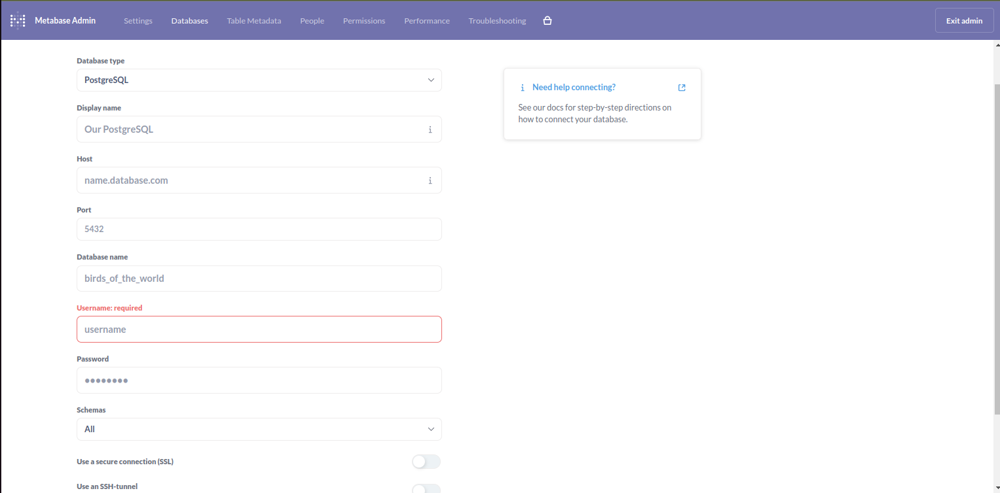

# Elevate data service

### **Service Overview**

This service comprises two interconnected data pipelines designed to handle real-time data processing and dashboard generation. The architecture leverages Kafka, Flink, PostgreSQL, and Metabase to ensure seamless data transformation, storage, and visualization. **Scala** is used as the primary language for implementing the Flink jobs, ensuring robust and efficient data processing. Below is an overview of the two pipelines:

---

#### **Pipeline 1: Data Ingestion and Transformation**
1. **Source**: Messages are read from a Kafka topic containing raw data.
2. **Processing**: A Flink job, implemented in Scala, processes these messages, transforming them into the required format.
3. **Destination**: The transformed data is loaded into a PostgreSQL database for persistent storage.

This pipeline ensures the data is cleansed, structured, and readily available for downstream processes.

---

#### **Pipeline 2: Event-Driven Dashboard Updates**
1. **Trigger**: New data inserted into the PostgreSQL database triggers event generation based on specific column values.
2. **Message Generation**: A message is created and published to another Kafka topic, encapsulating the required event details.
3. **Processing**: Another Flink job, implemented in Scala, consumes these messages and performs the following actions:
    - **Dashboard Management**: Interacts with Metabase APIs to create or update dashboards dynamically.
    - **Status Updates**: Logs the processing details or updates the status in PostgreSQL tables for monitoring and traceability.

This pipeline facilitates real-time dashboard updates, ensuring the visualization layer reflects the latest data changes.

---

### **Key Features**
- **Scala for Data Processing**: All Flink jobs are implemented in Scala, leveraging its functional programming capabilities for robust data transformation and event handling.
- **Real-Time Processing**: Flink ensures low-latency processing for ingesting and transforming data streams.
- **Scalability**: Kafka and Flink enable high-throughput, scalable data processing pipelines.
- **Persistence and Traceability**: PostgreSQL provides reliable data storage and supports operational logging.
- **Dynamic Visualization**: Automated dashboard creation and updates using Metabase APIs streamline analytics workflows.

This service delivers an efficient and automated end-to-end solution for data processing, visualization, and monitoring, ensuring real-time insights and traceability.

# Supported Operating system

Ubuntu (Recommended: Version 20 and above)

# Setup 
1 . **Java** \
2 . **Scala** \
3 . **PostgreSQL** \
4 . **Metabase service setup using docker** \
5 . **Kafka** \
6 . **Flink** 


# Prerequisites

To set up the Metabase application, ensure you have Docker and Docker Compose installed on your system. For Ubuntu users, detailed installation instructions for both can be found in the documentation here: [How To Install and Use Docker Compose on Ubuntu](https://docs.docker.com/engine/install/ubuntu/).  Once these prerequisites are in place, you're all set to get started with setting up the Project application.

# Installation

**Create data-pipeline Directory:** Establish a directory titled **data-pipeline**.

> Example Command: `mkdir data-pipeline && cd data-pipeline/`
> **Caution:** Before proceeding, please ensure that the ports given here are available and open. It is essential to verify their availability prior to moving forward. You can run below command in your terminal to check this
## 1 . PostgreSQL setup 

To setup PostgreSQL follow these documentation : [To install PostgreSQL on Ubuntu](https://www.postgresql.org/download/linux/ubuntu/) 

## 2 . Metabase service setup using docker

**Run the container with below command**
```         
docker run -d -p 3000:3000 \\
--platform linux/amd64 \\
-e MB_DB_TYPE=postgres \\
-e MB_DB_DBNAME=metabase_dev \\
-e MB_DB_PORT=5432 \\
-e MB_DB_USER=postgres \\
-e MB_DB_PASS=elevatedata \\
-e MB_DB_HOST=10.148.0.49 \\
--name dev-elevate-metabase \\
metabase/metabase
```
**Explanation of the Command**

```-d``` : Run the container in detached mode (in the background).

```-p 3000:3000``` : Map port 3000 of the host to port 3000 in the container (Metabase web UI).

```--platform linux/amd64``` : Specify the platform for the container (useful for running on non-native architectures).

```-e MB_DB_TYPE=postgres``` : Set the database type to PostgreSQL.

```-e MB_DB_DBNAME=metabase_dev``` : Define the database name.

```-e MB_DB_PORT=5432``` : Set the PostgreSQL port.

``` -e MB_DB_USER=postgres``` : Set the PostgreSQL user.

```-e MB_DB_PASS=elevatedata``` : Set the password for the PostgreSQL user.

```-e MB_DB_HOST=10.148.0.49``` : Specify the host IP address of the PostgreSQL database.

```--name dev-elevate-metabase``` : Assign a name to the Docker container (dev-elevate-metabase).

```metabase/metabase``` : The official Metabase Docker image.

**Start Containers**
```
docker-compose up -d
```
**metabase url**
```
localhost:3000
```
# Setup Kafka 

Here is a step-by-step guide to setting up **Apache Kafka** on **Ubuntu**:

### Step 1: Update and Install Java

Kafka requires Java. Update your system and install **OpenJDK**.

1 . Update packages:
   ```
   sudo apt update
   ```

2 . Install Java:
   ```
   sudo apt install openjdk-11-jdk
   ```

3 . Verify the installation:
   ```
   java -version
   ```

### Step 2: Install Kafka

1 . Download the latest Kafka version from the official site:
   ```
   wget https://downloads.apache.org/kafka/3.5.0/kafka_2.13-3.5.0.tgz
   ```

2 . Extract the downloaded file:
   ```
   tar -xvzf kafka_2.13-3.5.0.tgz
   ```

3 . Move it to a preferred directory:
   ```
   sudo mv kafka_2.13-3.5.0 /usr/local/kafka
   ```

### Step 3: Start Zookeeper

Kafka requires Zookeeper to run.

1 . Start Zookeeper:
   ```
   cd /usr/local/kafka

   bin/zookeeper-server-start.sh config/zookeeper.properties
   ```

2 . Open a new terminal or tab to keep Zookeeper running.

### Step 4: Start Kafka Server
1 . Start the Kafka server in another terminal:
   ```
   bin/kafka-server-start.sh config/server.properties
   ```

### Step 5: Create a Topic
1 . Create a topic named `test`:
   ```
   bin/kafka-topics.sh --create --topic test --bootstrap-server localhost:9092 --partitions 1 --replication-factor 1
   ```

2 . List all topics to verify:
   ```
   bin/kafka-topics.sh --list --bootstrap-server localhost:9092
   ```
### Step 5: Create a consumer group :
```
./kafka-consumer-groups.sh --describe --group    ml_survey_faust --bootstrap-server localhost:9092
```

### Step 6: Set Up Kafka as a Service (Optional)

1 . Create a systemd unit file for Kafka:
   ```
   sudo nano /etc/systemd/system/kafka.service
   ```
2 . Add the following content:
   ```
   [Unit]
   Description=Apache Kafka Server
   After=network.target

   [Service]
   User=your-username
   Group=your-group
   ExecStart=/usr/local/kafka/bin/kafka-server-start.sh /usr/local/kafka/config/server.properties
   ExecStop=/usr/local/kafka/bin/kafka-server-stop.sh
   Restart=on-abnormal

   [Install]
   WantedBy=multi-user.target
   ```
3 . Reload systemd:
   ```
   sudo systemctl daemon-reload
   ```

4 . Start Kafka service:
   ```
   sudo systemctl start kafka
   ```
Now Kafka should be up and running on your Ubuntu system.

# Setup Flink

1 . Use the following wget command to download 
``` 
wget https://archive.apache.org/dist/flink/flink-1.13.2/flink-1.13.2-bin-scala_2.12.tgz
```
2 . Extract the Flink Archive

After the download completes, extract the downloaded .tgz file:
```
tar xzf flink-1.13.2-bin-scala_2.12.tgz
```
3 . Navigate to the Flink Directory

Change into the Flink directory:
```
cd flink-1.13.2/
```
4 . Start/Stop the Flink Cluster

To start and stop the Flink cluster, use the following commands:

a .Start the Flink cluster:
```
sudo ./bin/start-cluster.sh
```
b . Stop the Flink cluster:
```
sudo ./bin/stop-cluster.sh
```
5 . check the flink UI running at
```
localhost:8081
```
6 . Once the flink , metabase and postgres is up and running update the necessary configuration in [metabase-dashboard.conf](https://github.com/prashanthShiksha/data-pipeline/blob/dev-deploy/metabase-jobs/dashboard-creator/src/main/resources/metabase-dashboard.conf) file and save the changes.

# Setup the data pipeline Job

1 . Build the job
```
mvn clean install -DskipTests
```
2 . after Building the job get this jar file path
```
.
├── data-pipeline
│   ├── project-jobs
│       ├── project-stream-processor
│           ├── target
│               ├── project-stream-processor-1.0.0.jar
└── ...
```
3 . Submit the Job in Development 

To submit a Flink job to the cluster, use the following command:
```
sudo ./bin/flink run -m localhost:8081 /opt/dev/data-pipeline/project-jobs/project-stream-processor/target/project-stream-processor-1.0.0.jar
```

# Setup the Metabase Job

1 . Build the job
```
mvn clean install -DskipTests
```
2 . after Building the job get this jar file path
```
.
├── data-pipeline
│   ├── metabase-jobs
│       ├── dashboard-creator
│           ├── target
│               ├── dashboard-creator-1.0.0.jar
└── ...
```
3 . Submit the Job in Development

To submit a Flink job to the cluster, use the following command:
```
sudo ./bin/flink run -m localhost:8081 /opt/dev/data-pipeline/metabase-jobs/dashboard-creator/target/dashboard-creator-1.0.0.jar
```
### Note : **Instead of setting it manually data pipeline job and the metabase job run the following shell script from the deployment.**
```
.
├── data-pipeline
│   ├── deployment
│       ├── run.sh
└── ...
```
```
./run.sh
```
# Connect PostgreSQL with Metabase 

Add Postgres db configuration in metabase 



Fill the required configuration details 
